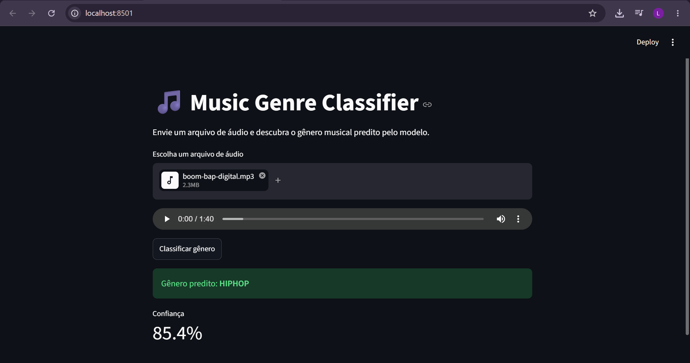

# Music Genre Classifier 🎵



API REST que classifica o gênero musical de arquivos de áudio usando Machine Learning.

> ⚠️ **Cold start:** a primeira requisição após período de inatividade pode levar ~50s (limitação do plano gratuito do Render).

## Demo

- **Interface visual (Streamlit):** rode localmente com o passo a passo abaixo
- **API direta (Swagger):** https://music-genre-classifier-os8j.onrender.com/docs

## Como funciona

O modelo foi treinado com o dataset GTZAN (1000 músicas, 10 gêneros). Para cada arquivo de áudio, o Librosa extrai 57 features — MFCCs, spectral bandwidth, chroma, tempo, entre outras — que alimentam um classificador XGBoost.

## Resultados

| Modelo | Acurácia |
|--------|----------|
| XGBoost | **73.5%** |
| SVM | 73.0% |
| Random Forest | 68.5% |

### Análise de erros

O modelo acerta bem gêneros com características acústicas distintas (classical: F1 0.95, metal: F1 0.89). Os maiores erros ocorrem em gêneros com sobreposição histórica — rock confunde com blues e country (F1 0.47), disco confunde com hiphop e pop (F1 0.52). Esses erros são musicalmente esperados.

Features clássicas + XGBoost atingem 73.5% no GTZAN. A evolução natural seria um CNN sobre espectrogramas, que alcança 90%+ no mesmo dataset — priorizei aqui um pipeline end-to-end em produção com paridade de features garantida.

## Endpoints

- `POST /predict` — recebe arquivo de áudio (`.wav`, `.mp3`, `.ogg`, `.flac`), retorna gênero e confiança
- `GET /predictions` — histórico das últimas predições
- `GET /health` — status da API e do modelo

## Stack

Python · FastAPI · XGBoost · Librosa · SQLAlchemy · Docker · Render · Streamlit

## Decisões de arquitetura

**Paridade treino/inferência:** O modelo foi treinado no CSV do GTZAN. Para garantir que a API reproduz exatamente o mesmo vetor de 57 features, foi criado o módulo `src/features.py` com a função `extract_features()` — usada tanto na validação quanto na inferência. Diferenças validadas contra o CSV original ficaram abaixo de 0.3%.

## Como rodar localmente

```bash
git clone https://github.com/Leonardomachad0/music-genre-classifier
cd music-genre-classifier

# Windows
python -m venv venv && venv\Scripts\activate

# Mac/Linux
python -m venv venv && source venv/bin/activate

pip install -r requirements.txt
uvicorn app.main:app --reload
```

Acesse http://localhost:8000/docs

Para a interface visual, em outro terminal (com o venv ativo):

```bash
streamlit run streamlit_app.py
```

Acesse http://localhost:8501